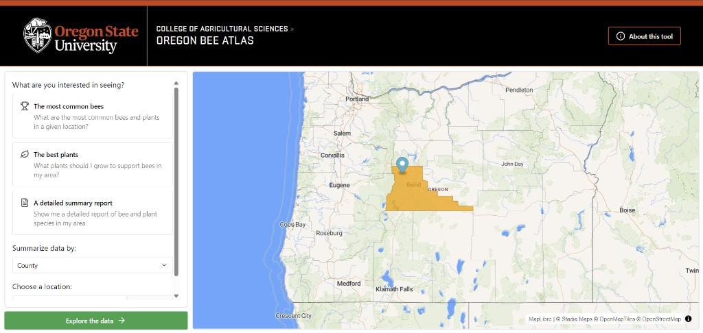

# Oregon Pollinator Explorer

An interactive web tool for Oregon bee enthusiasts, land managers, and conservation practitioners who need fast, location-based insight into bee-plant relationships.

*Figure 1. Oregon Pollinator Explorer interface with map-based location selection and analysis options for common bees, best plants, and detailed reports.*

Pollinator-support decisions are often made with limited local interaction data, which can lead to lower-impact habitat restoration choices. Oregon Pollinator Explorer turns complex biodiversity records into practical, map-driven guidance so local gardeners, bee enthusiasts, and conservation teams can quickly discover pollinator-friendly plants, understand local interaction patterns, and make more confident habitat and planting decisions.

## Key Features

- See bee and plant interaction summaries for a selected Oregon location using county, ecoregion, or related geographic context.
- Generate a ranked list of recommended plants with supporting context such as observed top bee associations.
- Produce downloadable PDF reports of local bee-plant interactions to share with teams or stakeholders.
- Explore results in a responsive interactive map experience that stays dependable, even during periods of heavier use.

## Try It Out 
- Link to the [Oregon Wild Bee and Plant Guide](https://oregon-bee-project.github.io/oregon-wild-bee-and-plant-guide/) live site

### System and Platform Notes

- Tested/developed for modern desktop browsers.
- Requires internet access for any remote services or deployment links.
- PDF export and detailed report endpoints include backend guardrails to protect small hosting tiers from overload.

## Team Credits

### Current Team
- `Lincoln Best` - `(lincoln.best@oregonstate.edu)` -`[project advisor]`
- `Kellen Sullivan` - `(sullivk3@oregonstate.edu)` 
- `Zachary Allen` - `(allezach@oregonstate.edu)` 
- `Henry Kanaskie` - `(kanaskih@oregonstate.edu)` 
- `Dylan Brehm` - `(brehmd@oregonstate.edu)` 
- `Alexander Montgomery` - `(montgale@oregonstate.edu)`

## Contact

If you have any questions, feel free to contact any of the emails above or create a GitHub issue. 

---
